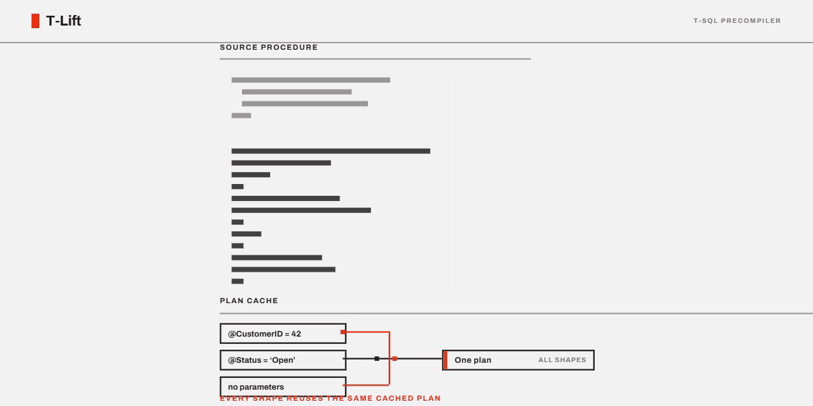

# T-Lift

[](https://github.com/sasloz/T-Lift/actions/workflows/integration-tests.yml)

T-Lift is a T-SQL precompiler that lets developers use directive-based meta-code within stored procedures to generate controlled, dynamic T-SQL. It is designed for teams that understand when and why dynamic SQL helps SQL Server build more *predictable* execution plans, but want a cleaner, safer, and more comfortable way to apply it without hand-crafting dynamic SQL everywhere.

Written entirely in T-SQL. Ships as a single stored procedure (`sp_tlift`).

---

---

## Table of Contents

- [The Idea](#the-idea-in-a-nutshell-aka-hello-world)
- [What T-Lift Does](#what-t-lift-does)
- [How T-Lift Compares](#how-t-lift-compares)
- [Installation](#installation)
- [Business Context Demos](#business-context-demos)
- [Basic Usage](#basic-usage)
- [Quick Start](#quick-start)
- [Directive Reference](#directive-reference)
  - [Dynamic SQL Sections](#dynamic-sql-sections)
  - [Single-Line Conditionals](#single-line-conditionals)
  - [Remove Lines](#remove-lines)
  - [Block Conditionals](#block-conditionals)
  - [Else and Else-If](#else-and-else-if)
  - [Comment-Out Lines](#comment-out-lines)
  - [Named Sections](#named-sections)
  - [Recompile Hint](#recompile-hint)
  - [Named Conditions](#named-conditions)
  - [Block Removal](#block-removal)
  - [Buckets (Plan Cache Segmentation)](#buckets-plan-cache-segmentation)
  - [Sort Whitelists (Safe Dynamic ORDER BY)](#sort-whitelists-safe-dynamic-order-by)
- [Variables vs. Parameters](#variables-vs-parameters)
- [Wrapper Procedures](#wrapper-procedures)
- [Validation Mode](#validation-mode)
- [Deployment and Drift Detection](#deployment-and-drift-detection)
- [Annotation Suggestions](#annotation-suggestions)
- [Permissions Note](#permissions-note)
- [Parameters](#parameters)
- [Compatibility](#compatibility)
- [Roadmap](#roadmap)
- [Version Log](#version-log)

---

## The Idea in a Nutshell aka 'Hello World!'

Consider to get an idea how T-Lift works this common pattern in SQL Server stored procedures:

```sql
CREATE OR ALTER PROCEDURE dbo.SearchOrders
    @CustomerID INT = NULL,
    @Status NVARCHAR(20) = NULL
AS
SELECT o.OrderID, o.CustomerID, o.OrderDate, o.Status, o.TotalAmount
FROM dbo.Orders o
WHERE (@CustomerID IS NULL OR o.CustomerID = @CustomerID)
  AND (@Status IS NULL OR o.Status = @Status)
```

This is a classic "catch-all" or "one-size-fits-all" query. It works correctly, but the SQL Server query optimizer cannot produce an optimal plan for it. The optimizer must account for every possible NULL/non-NULL combination at once, which typically means a full scan regardless of which parameters you actually supply.

Worse, the execution plan that gets cached depends on whichever parameter values happened to come in first. Call it with `@CustomerID = 42` and SQL Server might cache a plan with an index seek. Call it next with no parameters — and that seek-based plan is reused for a full table scan scenario. The logical reads can differ by orders of magnitude for the same result set, depending purely on compilation order.

This is parameter sniffing at work. It is not a bug — it is how SQL Server caching works. But it means that this common coding pattern quietly produces unpredictable performance in production.

There is no index that fixes this structurally. The issue is in how the query is written.

### The Known Solution: Dynamic SQL

The SQL Server community has long recommended dynamic SQL via `sp_executesql` for this kind of scenario. By building only the predicates that actually apply at runtime, you let the optimizer see a simpler, more specific query — and it produces a better plan.

But writing dynamic SQL by hand is tedious. You lose IntelliSense, syntax highlighting, and the ability to just highlight and execute a query in SSMS. The code is harder to read, harder to maintain, and harder to debug.

That is the trade-off T-Lift tries to eliminate.

---

## What T-Lift Does

T-Lift reads your existing stored procedure, looks for directives you place inside T-SQL comments, and generates a new version of that procedure using dynamic SQL and `sp_executesql`.

Because the directives are just comments, your original procedure remains fully valid and executable. You can develop, test, and debug as usual in SSMS or any other editor. When you are ready, you run T-Lift to produce the optimized version.

The basic idea: you annotate your procedure, T-Lift renders it.

---

## How T-Lift Compares

Every known answer to the catch-all problem forces a trade-off between readability and plan quality — except one:

| Approach | Plan quality | Compile CPU | Readability / tooling | Maintenance |
|---|---|---|---|---|
| Catch-all query (`@p IS NULL OR ...`) | Poor — one plan for every shape | Low | Full SSMS comfort | Low |
| `OPTION(RECOMPILE)` | Optimal per call | **Paid on every execution** | Full SSMS comfort | Low |
| Hand-written dynamic SQL | Optimal per shape, plan reuse | Low | Lost — strings, no IntelliSense, injection risk if done sloppily | High |
| Manually maintained specialized procedures | Optimal per pattern | Low | OK, but near-duplicate code | Very high |
| PSP optimization (SQL 2022+) | Better, but equality predicates only, limited predicate count | Low | Full comfort | None (but no control) |
| **T-Lift** | Optimal per shape, plan reuse | Low | **Source stays valid, debuggable T-SQL** | Renders are generated; `@checkDrift` finds stale ones |

A side effect worth calling out: T-Lift **always** emits parameterized `sp_executesql` with a correctly typed parameter list taken from `sys.parameters`. The generated code never concatenates parameter values into the SQL string — which makes it safer than a lot of hand-written dynamic SQL out there.

---

## Installation

1. Grab `sp_tlift.sql` from this repository.
2. Execute it in a **separate** user database (not the database where your target procedures live).

T-Lift reads metadata from other databases via `sys.sql_modules` and `sys.parameters`, so the executing user needs appropriate read permissions on the target database.

```sql
-- Example: install into a dedicated database
USE [TLift_Engine];
GO

-- Execute the sp_tlift.sql script
-- (via SSMS "Open File" or sqlcmd -i sp_tlift.sql)
```

You can also ask T-Lift to explain itself:

```sql
EXEC dbo.sp_tlift @help = 1;
```

---

## Testing

The repository includes a small SQL Server regression harness under `intern_stuff/`.

1. Run `intern_stuff/test_setup.sql` to create `TLift_Engine`, `TLift_TestDB`, and the sample data set.
2. Execute `sp_tlift.sql` in `TLift_Engine`.
3. Run `intern_stuff/test_procedures.sql` to create the annotated source procedures.
4. Run `intern_stuff/run_tests.sql` to render, deploy, and execute the full suite.
5. Inspect `TLift_TestDB.dbo.TestResults` for persisted pass/fail results.

The demo script in `demos/` assumes the same split: `TLift_Engine` hosts `sp_tlift`, and `TLift_TestDB` hosts the procedures being rendered.

In addition, `integration_tests/` contains an independent harness (117 assertions covering every directive plus the lifecycle features) that runs on every push via GitHub Actions against SQL Server 2017, 2019, 2022, and 2025 containers. Run it locally with:

```powershell
powershell.exe -NoProfile -ExecutionPolicy Bypass -File .\integration_tests\run_integration_tests.ps1 -Server localhost -User sa -Password '...'
```

---

## Business Context Demos

The folder `demos/business_context/` contains ready-to-run demos for more realistic business workloads:

- B2B order workbench with many optional search filters.
- Dispatch SLA dashboard with wrapper procedure generation.
- Receivables risk dashboard with bucket-based plan cache segmentation.
- Query Store evidence script for comparing T-Lift with `OPTION(RECOMPILE)`.

These examples are meant to show why T-Lift can be useful even though `OPTION(RECOMPILE)` is a valid SQL Server performance tool: for recurring high-frequency business query shapes, dynamic SQL powered by T-Lift can be a valid alternative because it avoids paying compilation CPU on every execution while keeping the source procedure readable. This is not a universal "T-Lift is always faster" claim; it is evidence for workloads where repeated business shapes and compile CPU make plan reuse valuable. The folder also includes `run_business_context_demos.ps1` for running the full demo set without `sqlcmd`.

---

## Basic Usage

```sql
DECLARE @dynsql NVARCHAR(MAX);

EXEC dbo.sp_tlift
    @DatabaseName   = 'YourDatabase',
    @ProcedureName  = 'YourProcedure',
    @Result         = @dynsql OUTPUT;

PRINT @dynsql;
```

T-Lift reads the source procedure, processes directives, and returns the rendered dynamic SQL procedure as a string in `@Result`. From there you can review it, adjust it, and deploy it.

---

## Quick Start

Here is a complete end-to-end walkthrough. We start with a catch-all query, annotate it with T-Lift directives, and render it.

### 1. Create the source procedure

This is a standard catch-all query — it works correctly but suffers from parameter sniffing:

```sql
CREATE OR ALTER PROCEDURE dbo.SearchOrders
    @CustomerID INT = NULL,
    @Status NVARCHAR(20) = NULL
AS
                                        --#[
SELECT o.OrderID, o.CustomerID, o.OrderDate, o.Status, o.TotalAmount
FROM dbo.Orders o
WHERE                                   --#if @CustomerID IS NOT NULL OR @Status IS NOT NULL
(                                       --#-
@CustomerID IS NULL OR                  --#-
o.CustomerID = @CustomerID              --#if @CustomerID IS NOT NULL
)                                       --#-
AND                                     --#if @CustomerID IS NOT NULL AND @Status IS NOT NULL
(                                       --#-
@Status IS NULL OR                      --#-
o.Status = @Status                      --#if @Status IS NOT NULL
)                                       --#-
                                        --#]
```

Note: The procedure is still fully valid T-SQL. The `--#` directives are just comments — you can execute this procedure as-is in SSMS.

### 2. Render it with T-Lift

```sql
DECLARE @dynsql NVARCHAR(MAX);

EXEC dbo.sp_tlift
    @DatabaseName   = 'YourDatabase',
    @ProcedureName  = 'SearchOrders',
    @Result         = @dynsql OUTPUT;

PRINT @dynsql;
```

### 3. Review the output

T-Lift produces a new procedure that builds only the applicable predicates at runtime:

```sql
CREATE PROCEDURE dbo.tlift_version_of_your_sproc
    @CustomerID INT = NULL,
    @Status NVARCHAR(20) = NULL
AS
DECLARE @sql NVARCHAR(MAX) = N''
SET @sql = @sql + 'SELECT o.OrderID, o.CustomerID, o.OrderDate, o.Status, o.TotalAmount' + CHAR(13)+CHAR(10)
SET @sql = @sql + 'FROM dbo.Orders o' + CHAR(13)+CHAR(10)
IF @CustomerID IS NOT NULL OR @Status IS NOT NULL
    SET @sql = @sql + 'WHERE' + CHAR(13)+CHAR(10)
IF @CustomerID IS NOT NULL
    SET @sql = @sql + 'o.CustomerID = @CustomerID' + CHAR(13)+CHAR(10)
IF @CustomerID IS NOT NULL AND @Status IS NOT NULL
    SET @sql = @sql + 'AND' + CHAR(13)+CHAR(10)
IF @Status IS NOT NULL
    SET @sql = @sql + 'o.Status = @Status' + CHAR(13)+CHAR(10)
EXEC sp_executesql @sql, N'@CustomerID int, @Status nvarchar(20)', @CustomerID, @Status
```

Now each combination of parameters gets its own optimized plan. Call it with `@CustomerID = 42` — only the `CustomerID` predicate is included. Call it with no parameters — no WHERE clause at all.

### 4. Deploy

Review the rendered output, then execute it in your target database to create the optimized procedure. You can customize the output procedure name with the `@ProcedureNameNew` parameter.

---

## Directive Reference

All directives live inside T-SQL line comments (`--#...`), so they do not affect the original procedure in any way.

### Dynamic SQL Sections

Mark which parts of your procedure should become dynamic SQL.

```
--#[              Open a dynamic SQL section
--#]              Close a dynamic SQL section
```

Only code between `--#[` and `--#]` is rendered as dynamic SQL. Everything outside these brackets passes through unchanged. A single procedure can have multiple sections.

```sql
CREATE OR ALTER PROCEDURE dbo.SearchCustomers
    @City NVARCHAR(50) = NULL
AS
                                    --#[
SELECT c.CustomerID, c.FirstName, c.LastName, c.City
FROM dbo.Customers c
WHERE                               --#if @City IS NOT NULL
(                                   --#-
@City IS NULL OR                    --#-
c.City = @City                      --#if @City IS NOT NULL
)                                   --#-
                                    --#]
```

### Single-Line Conditionals

```
--#if <condition>
```

Controls whether the **line it is placed on** is included in the rendered dynamic SQL. The condition is evaluated at runtime in the generated procedure.

```sql
SELECT c.CustomerID, c.FirstName, c.LastName
FROM dbo.Customers c
WHERE                               --#if @CustomerID IS NOT NULL
c.CustomerID = @CustomerID          --#if @CustomerID IS NOT NULL
```

When `@CustomerID IS NULL`, the rendered SQL simply becomes:

```sql
SELECT c.CustomerID, c.FirstName, c.LastName
FROM dbo.Customers c
```

No WHERE clause at all — and the optimizer knows it.

### Remove Lines

```
--#-
```

Marks a line to be removed entirely in the dynamic version. Use this for the static fallback logic (`@param IS NULL OR ...`) that you need in the original procedure but not in the dynamic one.

```sql
WHERE                               --#if @City IS NOT NULL
(                                   --#-
@City IS NULL OR                    --#-
c.City = @City                      --#if @City IS NOT NULL
)                                   --#-
```

The lines marked `--#-` are the "glue" that makes the original procedure work without dynamic SQL. T-Lift strips them out because the `--#if` conditions already handle the logic.

### Block Conditionals

For multi-line blocks that should all be governed by one condition:

```
--#{if <condition>      Open a conditional block
--#}                    Close it
```

```sql
CREATE OR ALTER PROCEDURE dbo.OrderReport
    @CustomerID INT = NULL,
    @IncludeDetails BIT = 0
AS
                                    --#[ OrderSummary
SELECT o.OrderID, o.CustomerID, o.OrderDate, o.TotalAmount
FROM dbo.Orders o
WHERE                               --#if @CustomerID IS NOT NULL
o.CustomerID = @CustomerID          --#if @CustomerID IS NOT NULL
                                    --#]

                                    --#{if @IncludeDetails = 1
                                    --#[ OrderDetails
SELECT oi.OrderItemID, oi.OrderID, oi.ProductID, oi.Quantity, oi.LineTotal
FROM dbo.OrderItems oi
INNER JOIN dbo.Orders o ON oi.OrderID = o.OrderID
WHERE                               --#if @CustomerID IS NOT NULL
o.CustomerID = @CustomerID          --#if @CustomerID IS NOT NULL
                                    --#]
                                    --#}
```

When `@IncludeDetails = 0`, the entire detail query — including its dynamic SQL section — is skipped.

#### Block Conditionals Inside Dynamic SQL Sections

`--#{if` blocks can also be used **inside** a `--#[` section to conditionally include groups of lines — such as an optional WHERE clause — with the condition stated only once. This is the cleanest way to handle a single optional filter:

```sql
CREATE OR ALTER PROCEDURE dbo.SearchByCustomer
    @CustomerID INT = NULL
AS
                                    --#[ Search
SELECT c.CustomerID, c.FirstName, c.LastName, c.City
FROM dbo.Customers c
                                    --#{if @CustomerID IS NOT NULL
WHERE
c.CustomerID = @CustomerID
                                    --#}
                                    --#]
```

When `@CustomerID` is NULL, the rendered SQL has no WHERE clause at all. When non-NULL, it includes `WHERE c.CustomerID = @CustomerID`. The condition appears once on the `--#{if` line instead of being repeated on every line.

You can still combine `--#{if` with `--#-` for catch-all static SQL patterns:

```sql
                                    --#{if @CustomerID IS NOT NULL
WHERE
(                                   --#-
@CustomerID IS NULL OR              --#-
c.CustomerID = @CustomerID
)                                   --#-
                                    --#}
```

### Else and Else-If

Inside a block conditional, you can add alternative branches:

```
--#else                  Else branch
--#{elseif <condition>   Else-if branch with a new condition
```

```sql
CREATE OR ALTER PROCEDURE dbo.CustomerList
    @SortMode INT = 0
AS
                                    --#[ CustList
SELECT c.CustomerID, c.FirstName, c.LastName, c.City
FROM dbo.Customers c
                                    --#]

                                    --#{if @SortMode = 1
PRINT 'Sorting by name'
                                    --#{elseif @SortMode = 2
PRINT 'Sorting by city'
                                    --#else
PRINT 'Default sort order'
                                    --#}
```

This renders as a standard `IF / ELSE IF / ELSE` chain in the output.

### Comment-Out Lines

```
--#c
```

Keeps the line in the rendered output, but comments it out (prefixed with `--`). Useful for keeping reference information visible without executing it.

```sql
ORDER BY o.OrderDate DESC           --#c
```

In the rendered output, this becomes:

```sql
--ORDER BY o.OrderDate DESC
```

### Named Sections

You can give a dynamic SQL section a label by placing text after `--#[`. The label is embedded as a SQL comment (`/*label*/`) in the rendered `sp_executesql` call, making it easy to find specific queries in the plan cache.

```sql
                                    --#[ CustomerSearch
SELECT c.CustomerID, c.FirstName, c.LastName
FROM dbo.Customers c
WHERE                               --#if @City IS NOT NULL
c.City = @City                      --#if @City IS NOT NULL
                                    --#]
```

You can then find cached plans for this section:

```sql
SELECT cplan.usecounts, qtext.text, qplan.query_plan
FROM sys.dm_exec_cached_plans AS cplan
CROSS APPLY sys.dm_exec_sql_text(plan_handle) AS qtext
CROSS APPLY sys.dm_exec_query_plan(plan_handle) AS qplan
WHERE qtext.text LIKE '%/*CustomerSearch*/%'
  AND qtext.text NOT LIKE '%dm_exec_cached_plans%'
ORDER BY cplan.usecounts DESC;
```

### Named Conditions

```
--#define <name> = <condition>
```

Defines a reusable condition that can be referenced by name in `--#if`, `--#{if`, and `--#{elseif` directives. This eliminates repetition when the same condition appears in multiple places.

The `--#define` directive emits no output — it is metadata only. Place it before any `--#[` section that uses it.

```sql
CREATE OR ALTER PROCEDURE dbo.OrderReport
    @CustomerID INT = NULL,
    @IncludeDetails BIT = 0
AS
                                    --#define custFilter = @CustomerID IS NOT NULL

                                    --#[ OrderSummary
SELECT o.OrderID, o.CustomerID, o.OrderDate, o.TotalAmount
FROM dbo.Orders o
                                    --#{if custFilter
WHERE
o.CustomerID = @CustomerID
                                    --#}
                                    --#]

                                    --#{if @IncludeDetails = 1
                                    --#[ OrderDetails
SELECT oi.OrderItemID, oi.OrderID, oi.ProductID, oi.Quantity, oi.LineTotal
FROM dbo.OrderItems oi
INNER JOIN dbo.Orders o ON oi.OrderID = o.OrderID
                                    --#{if custFilter
WHERE
o.CustomerID = @CustomerID
                                    --#}
                                    --#]
                                    --#}
```

Without `--#define`, the condition `@CustomerID IS NOT NULL` would appear on every `--#if` / `--#{if` line — in this example, that is 4 repetitions. With a named condition, it is defined once and referenced by name.

Rules:
- Names must **not** start with `@` (to avoid confusion with parameters).
- Names are case-insensitive.
- A `--#define` must appear **before** any directive that references it (top-to-bottom processing).
- T-Lift warns if a defined condition is never used.

### Block Removal

```
--#{-             Open a removal block
--#-}             Close a removal block
```

All lines between `--#{-` and `--#-}` are treated as removed (like `--#-`), without needing per-line annotations. This reduces noise when you have several consecutive scaffolding lines.

```sql
                                    --#{if @CustomerID IS NOT NULL
WHERE
                                    --#{-
(
@CustomerID IS NULL OR
                                    --#-}
c.CustomerID = @CustomerID
                                    --#{-
)
                                    --#-}
                                    --#}
```

Block removal is most useful when you have 4+ consecutive lines that all need `--#-`. For fewer lines, individual `--#-` annotations may be simpler.

### Recompile Hint

```
--#recompile
```

Place this directive anywhere inside a dynamic SQL section. T-Lift will append `OPTION(RECOMPILE)` to the `sp_executesql` call for that section. Use this when you want fresh plans on every execution — for example, when parameter distributions are highly skewed and even the dynamic SQL approach benefits from recompilation.

```sql
                                    --#[ HeavyReport
                                    --#recompile
SELECT ...
FROM ...
WHERE ...                           --#if @DateFrom IS NOT NULL
                                    --#]
```

### Buckets (Plan Cache Segmentation)

```
--#buckets @param: value1, value2, value3
```

Place this directive on its own line inside a `--#[` / `--#]` section. T-Lift generates CASE-based bucket variables that segment the plan cache based on parameter value ranges. Each range gets its own cached plan, which is useful when the optimal plan shape varies significantly depending on the parameter's magnitude.

The values define the boundaries between buckets. For example, `--#buckets @Amount: 50, 100, 200` creates four buckets:

| Bucket | Condition |
|--------|-----------|
| `00`   | `@Amount < 50` |
| `01`   | `@Amount >= 50 AND @Amount < 100` |
| `02`   | `@Amount >= 100 AND @Amount < 200` |
| `03`   | `@Amount >= 200` |

The bucket value is prepended as a SQL comment (`/*01*/`) to the dynamic SQL, so `sp_executesql` caches a separate plan for each bucket.

```sql
CREATE OR ALTER PROCEDURE dbo.OrdersByAmount
    @MinAmount DECIMAL(10,2) = NULL
AS
                                                --#[ OrdersByAmount
                                                --#buckets @MinAmount: 50, 100, 200
SELECT o.OrderID, o.CustomerID, o.TotalAmount
FROM dbo.Orders o
WHERE                                           --#if @MinAmount IS NOT NULL
o.TotalAmount >= @MinAmount                     --#if @MinAmount IS NOT NULL
                                                --#]
```

You can use multiple `--#buckets` directives in the same section for multi-dimensional segmentation.

### Sort Whitelists (Safe Dynamic ORDER BY)

```
--#sort @param: col1, col2, col3
```

Dynamic sorting is the second most common reason people hand-write dynamic SQL — and the classic place where SQL injection sneaks in (`ORDER BY ' + @SortCol`). The `--#sort` directive generates a **whitelist-based** ORDER BY: only the listed columns are accepted, everything else raises an error at runtime.

Place the directive on its own line inside a `--#[` / `--#]` section. The parameter must be a procedure parameter (or a variable registered via `--#var` / `--#usevar`).

```sql
CREATE OR ALTER PROCEDURE dbo.SearchCustomers
    @City NVARCHAR(50) = NULL,
    @SortColumn NVARCHAR(50) = NULL
AS
                                    --#[ CustSearch
                                    --#sort @SortColumn: LastName, City
SELECT c.CustomerID, c.FirstName, c.LastName, c.City
FROM dbo.Customers c
WHERE                               --#if @City IS NOT NULL
c.City = @City                      --#if @City IS NOT NULL
                                    --#]
```

For every whitelisted column, T-Lift generates two accepted values: the column name itself (ascending) and the column name plus ` desc` (descending). Matching is case-insensitive and whitespace-tolerant. The rendered code looks like this:

```sql
IF @SortColumn IS NOT NULL
BEGIN
IF LOWER(LTRIM(RTRIM(@SortColumn))) = N'lastname' set @sql = @sql + ' ORDER BY LastName'+CHAR(13)+CHAR(10)
ELSE IF LOWER(LTRIM(RTRIM(@SortColumn))) = N'lastname desc' set @sql = @sql + ' ORDER BY LastName DESC'+CHAR(13)+CHAR(10)
ELSE IF LOWER(LTRIM(RTRIM(@SortColumn))) = N'city' set @sql = @sql + ' ORDER BY City'+CHAR(13)+CHAR(10)
ELSE IF LOWER(LTRIM(RTRIM(@SortColumn))) = N'city desc' set @sql = @sql + ' ORDER BY City DESC'+CHAR(13)+CHAR(10)
ELSE
BEGIN
RAISERROR('T-Lift: value of @SortColumn is not in the sort whitelist.', 16, 1)
RETURN
END
END
```

Calling the rendered procedure with `@SortColumn = N'CustomerID; DROP TABLE ...'` fails with a clear error — the value never reaches the SQL string. When `@SortColumn` is NULL, no ORDER BY is emitted at all.

---

## Variables vs. Parameters

T-Lift automatically picks up procedure **parameters** from `sys.parameters` — no extra work needed. But T-SQL **variables** declared inside the procedure body are a different story: the optimizer cannot see their values, and T-Lift cannot read them from metadata.

If you use local variables inside a dynamic SQL section, you need to tell T-Lift about them with two directives.

### Step 1: Mark the Declaration

```
--#var
```

Place this on the `DECLARE` line of any variable you want to pass into dynamic SQL.

```sql
DECLARE @ActiveOnly BIT = 1;               --#var
DECLARE @MinPrice DECIMAL(10,2) = 9.99;    --#var
```

One variable per line. Multi-variable declarations on a single line are not supported:

```sql
-- Not supported:
DECLARE @v1 INT = 1, @v2 INT = 2   --#var

-- Supported:
DECLARE @v1 INT = 1                 --#var
DECLARE @v2 INT = 2                 --#var
```

T-Lift supports a wide range of data types — `INT`, `VARCHAR`, `DECIMAL`, `DATETIME2`, `UNIQUEIDENTIFIER`, `NVARCHAR(MAX)`, and many more.

### Step 2: Register in the Dynamic Section

```
--#usevar @var1, @var2
```

Inside a `--#[` / `--#]` section, this tells T-Lift to include these variables in the `sp_executesql` parameter list. The directive can go on any line within the section.

```sql
CREATE OR ALTER PROCEDURE dbo.ActiveProducts
    @Category NVARCHAR(50) = NULL
AS
DECLARE @ActiveOnly BIT = 1;               --#var

                                            --#[ ActiveProds
SELECT p.ProductID, p.ProductName,          --#usevar @ActiveOnly
       p.Category, p.UnitPrice
FROM dbo.Products p
WHERE                                       --#if @Category IS NOT NULL OR @ActiveOnly = 1
p.Category = @Category                      --#if @Category IS NOT NULL
AND                                         --#if @Category IS NOT NULL AND @ActiveOnly = 1
p.IsActive = @ActiveOnly                    --#if @ActiveOnly = 1
                                            --#]
```

Now both the parameter `@Category` and the variable `@ActiveOnly` are passed to `sp_executesql`, and the optimizer can see both values at compile time.

---

## Wrapper Procedures

For scenarios where you want separate plan cache entries per usage pattern — not just per query shape within dynamic SQL — T-Lift can generate **wrapper procedures**. A wrapper is a dispatcher that routes calls to specialized child procedures based on parameter conditions, giving each child its own cached plan.

This is the approach that many SQL Server experts recommend for extreme parameter sniffing cases, but it is painful to maintain by hand. T-Lift generates the wrapper and all child procedures from a single annotated source.

### Directives

```
--#wrapper                              Enable wrapper mode
--#branch <suffix> <condition>          Define a conditional child branch
--#branch-default <suffix>              Define the default fallback child
```

### Example

```sql
CREATE OR ALTER PROCEDURE dbo.SearchCustomers
    @CustomerID INT = NULL,
    @City NVARCHAR(50) = NULL
AS
--#wrapper
--#branch _byCust @CustomerID IS NOT NULL
--#branch _byCity @City IS NOT NULL
--#branch-default _all
                                        --#[ CustSearch
SELECT c.CustomerID, c.FirstName, c.LastName, c.Email, c.City
FROM dbo.Customers c
WHERE                                   --#if @CustomerID IS NOT NULL OR @City IS NOT NULL
(                                       --#-
@CustomerID IS NULL OR                  --#-
c.CustomerID = @CustomerID              --#if @CustomerID IS NOT NULL
)                                       --#-
AND                                     --#if @CustomerID IS NOT NULL AND @City IS NOT NULL
(                                       --#-
@City IS NULL OR                        --#-
c.City = @City                          --#if @City IS NOT NULL
)                                       --#-
                                        --#]
```

T-Lift produces:

1. **A wrapper procedure** (`tlift_version_of_your_sproc`) that dispatches:
   ```sql
   IF @CustomerID IS NOT NULL
       EXEC [dbo].[tlift_version_of_your_sproc_byCust] @CustomerID = @CustomerID, @City = @City;
   ELSE IF @City IS NOT NULL
       EXEC [dbo].[tlift_version_of_your_sproc_byCity] @CustomerID = @CustomerID, @City = @City;
   ELSE
       EXEC [dbo].[tlift_version_of_your_sproc_all] @CustomerID = @CustomerID, @City = @City;
   ```

2. **Child procedures** (`_byCust`, `_byCity`, `_all`), each a full copy of the rendered dynamic SQL procedure with its own name. Each child gets its own plan cache entry.

---

## Validation Mode

Before rendering, you can validate your annotated procedure for common mistakes:

```sql
EXEC dbo.sp_tlift
    @DatabaseName  = 'YourDatabase',
    @ProcedureName = 'YourProcedure',
    @validateOnly  = 1;
```

This checks for:

- **Procedure existence** — does the target procedure actually exist?
- **Unmatched brackets** — every `--#[` needs a `--#]`.
- **Unknown directives** — catches typos like `--#fi` instead of `--#if`.
- **Out-of-section conditionals** — `--#if` used outside a `--#[` / `--#]` block.
- **Unmatched usevar references** — `--#usevar @x` without a corresponding `DECLARE @x ... --#var`.

No output is produced — just error messages if anything is off.

---

## Deployment and Drift Detection

Since version 1.10, T-Lift closes the render lifecycle: it can deploy for you, it stamps every render with traceability metadata, and it can tell you when a rendered procedure has gone stale.

### Deploy directly with `@execute`

```sql
EXEC dbo.sp_tlift
    @DatabaseName     = 'YourDatabase',
    @ProcedureName    = 'SearchOrders',
    @ProcedureNameNew = 'SearchOrders_TLift',
    @execute          = 1;
```

With `@execute = 1`, T-Lift drops any existing target procedure(s) and creates the rendered version(s) directly in the target database — including wrapper mode, where the wrapper and all child procedures are deployed in one call. The deployment splitter is quote- and comment-aware, so `GO` inside string literals is handled correctly. After deployment, T-Lift verifies that every expected procedure exists and fails loudly if not.

### The render metadata stamp

Every rendered procedure now starts with a metadata block:

```sql
/* T-Lift:render
TLiftVersion=01.10
SourceSchema=dbo
SourceProc=SearchOrders
SourceHash=0x8A1B...
RenderedUtc=2026-08-21T14:03:12.345
*/
```

`SourceHash` is the SHA2-256 hash of the source procedure's definition at render time. The stamp travels with the deployed procedure (it is part of its definition), which makes renders traceable — and stale renders detectable.

### Detect stale renders with `@checkDrift`

The biggest operational risk with any generate-and-deploy workflow: someone changes the source procedure and forgets to re-render. `@checkDrift` finds exactly that.

```sql
EXEC dbo.sp_tlift
    @DatabaseName = 'YourDatabase',
    @checkDrift   = 1;
```

This scans the target database for all T-Lift-rendered procedures, recomputes the hash of each source procedure, and returns a report:

| DriftStatus | Meaning |
|---|---|
| `OK` | Source unchanged since the render — the deployed version is current. |
| `DRIFT` | The source procedure changed after rendering. Re-render (e.g. with `@execute = 1`). |
| `SOURCE_MISSING` | The source procedure no longer exists. |

Run it as a scheduled check or as a pipeline gate — it needs no bookkeeping tables, the stamp inside each rendered procedure is the single source of truth.

---

## Annotation Suggestions

New to T-Lift, or facing a big legacy codebase? Let T-Lift find the candidates for you:

```sql
EXEC dbo.sp_tlift
    @DatabaseName  = 'YourDatabase',
    @ProcedureName = 'YourLegacyProcedure',
    @suggest       = 1;
```

`@suggest = 1` scans an (unannotated) procedure for the classic catch-all patterns:

- `(@param IS NULL OR column = @param)` — the textbook case, reported as `CATCH_ALL` with a concrete annotation recipe,
- `ISNULL(@param, ...)` and `COALESCE(@param, ...)` around parameters — common disguises of the same problem, reported for manual review.

The result set lists line numbers, the parameter involved, the offending line, and a suggested T-Lift annotation per finding. No rendering happens; the procedure is not modified.

---

## Permissions Note

Like every dynamic SQL solution, T-Lift-rendered procedures break **ownership chaining**: inside `sp_executesql`, permissions are checked against the *caller* for the underlying tables. In a static procedure, `EXECUTE` permission on the procedure is enough; with dynamic SQL it is not.

If you roll rendered procedures out to end users or restricted logins, plan for one of the usual patterns:

- grant `SELECT` on the referenced tables/views to the callers (or a role),
- create the rendered procedure with `EXECUTE AS OWNER`,
- use module signing (certificate + `ADD SIGNATURE`) for fine-grained control.

This is a property of dynamic SQL in SQL Server, not of T-Lift — but it belongs in every deployment checklist.

---

## Parameters

| Parameter | Type | Default | Description |
|-----------|------|---------|-------------|
| `@DatabaseName` | `NVARCHAR(128)` | — | Target database containing the source procedure. Required. |
| `@SchemaName` | `NVARCHAR(128)` | `'dbo'` | Schema of the source procedure. |
| `@ProcedureName` | `NVARCHAR(128)` | — | Name of the source procedure. Required. |
| `@ProcedureNameNew` | `NVARCHAR(128)` | `'tlift_version_of_your_sproc'` | Name for the generated procedure. |
| `@validateOnly` | `BIT` | `0` | Validate directives without rendering output. |
| `@debugLevel` | `INT` | `0` | Controls debug output verbosity (0 = off). |
| `@verboseMode` | `BIT` | `0` | Additional processing messages. |
| `@includeOurComments` | `BIT` | `0` | Include T-Lift's own comments in the output. |
| `@includeDebug` | `BIT` | `1` | Include debug-related markers in the output. |
| `@help` | `BIT` | `0` | Print usage information and exit. |
| `@execute` | `BIT` | `0` | Deploy the rendered procedure(s) directly into the target database (drop + create, wrapper-aware). |
| `@checkDrift` | `BIT` | `0` | Scan the target database for rendered procedures whose source changed since rendering. Returns a report; no rendering. `@ProcedureName` is not required in this mode. |
| `@suggest` | `BIT` | `0` | Scan the procedure for catch-all patterns and return annotation suggestions. No rendering. |
| `@Result` | `NVARCHAR(MAX) OUTPUT` | — | The rendered procedure as a string. |

---

## Compatibility

- **Minimum SQL Server version:** SQL Server 2017 (uses `STRING_AGG`, `TRIM`).
- On SQL Server 2022+, T-Lift uses `STRING_SPLIT` with the `enable_ordinal` option for guaranteed line ordering. On older versions, it falls back to an identity-based approach.
- T-Lift runs as a standard stored procedure — no CLR, no external dependencies.

---

## Roadmap

There is plenty left to do. Among other things:

- Histogram-driven automatic bucket boundaries (`--#buckets @p: auto` based on `sys.dm_db_stats_histogram`)
- A Query Store feedback loop that flags rendered procedures with plan regressions or unused buckets
- Auto-rewrite mode for `@suggest` (emit a fully annotated copy of the source, not just findings)
- Support for custom directive prefixes (currently `#` is hard-coded)
- Extended validation and better error messages
- Nested dynamic SQL sections

Feedback and contributions via GitHub issues are welcome.

---

## Version Log

- **1.10** — Lifecycle package: `@execute` (direct deployment incl. wrapper mode, quote-aware batch splitter), render metadata stamp (`T-Lift:render` block with source hash), `@checkDrift` (stale-render report: OK / DRIFT / SOURCE_MISSING). New `--#sort` directive for whitelist-based safe dynamic ORDER BY. New `@suggest` mode that detects catch-all patterns (`IS NULL OR`, `ISNULL`, `COALESCE`) and proposes annotations. Internal: parameter metadata is no longer fetched via `INSERT ... EXEC`, so sp_tlift result sets (`@suggest`, `@checkDrift`) can be captured with `INSERT ... EXEC`. GitHub Actions CI running the integration suite against SQL Server 2017/2019/2022/2025 containers.
- **1.02** - Fixed output parameter propagation from generated `sp_executesql` calls, directive scanning for `--#` tokens inside multiline string literals, and unknown directive validation so typos now fail instead of warning.
- **1.01** — Named conditions (`--#define`), block removal (`--#{-` / `--#-}`), `--#{if` blocks inside dynamic SQL sections (empty line guard fix), improved condition handling in `--#if` / `--#{if` / `--#{elseif` with named condition resolution, unused condition warnings, removal block bracket validation
- **1.00** — Else / else-if directives (`--#else`, `--#{elseif`), validation mode (`@validateOnly`), wrapper procedure generation (`--#wrapper`, `--#branch`), recompile hint (`--#recompile`), comment-out directive (`--#c`), bucket-based plan cache segmentation (`--#buckets`), unknown directive detection, bracket matching validation, TRY/CATCH error handling, safe procedure rename, SQL 2022+ ordinal support
- **0.46** — Replaced `sp_helptext` with `sys.sql_modules` for procedure text retrieval. Added support for output parameters.
- **0.43** — First public release on GitHub

---

## License

Apache 2.0 — see [LICENSE](LICENSE) for details.
